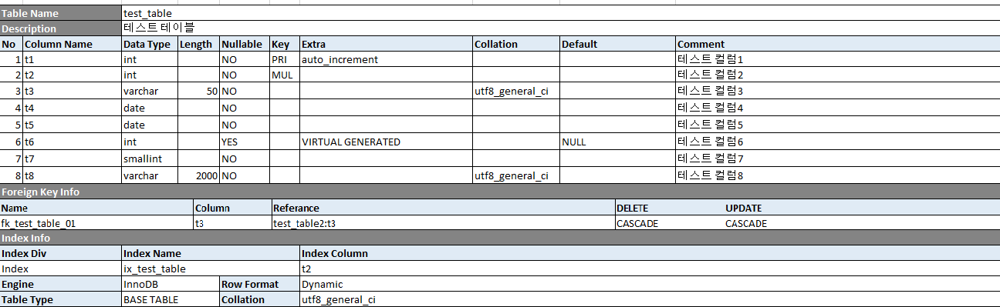

# mariadb-tablespec

MariaDB 테이블에 대한 명세표 생성(xlsx) 프로그램 입니다. 


## Use Package 
```
"github.com/360EntSecGroup-Skylar/excelize"
"github.com/go-sql-driver/mysql"
```

## Arg
```
go run .\MariaDB-TableSpec.go -h
Usage of 
  -database string
        Export for Database.
  -file string
        Export File Path and Name.
  -host string
        Target Database Host.
  -password string
        Database Connect Password.
  -port string
        Target Database Port. (default "3306")
  -user string
        Database Connect User. (default "root")
```

## Example Usage
```
MariaDB-TableSpec.exe -host="127.0.0.1" -port="3306" -user="root" -password="root" -database="mysql" -file="mysql_table.xlsx"
```
or
```
go run MariaDB-TableSpec.go -host="127.0.0.1" -port="3306" -user="root" -password="root" -database="mysql" -file="mysql_table.xlsx"
```
> go run 실행시 위의 필요 패키지는 설치되어있어야 합니다. 

## Output File
